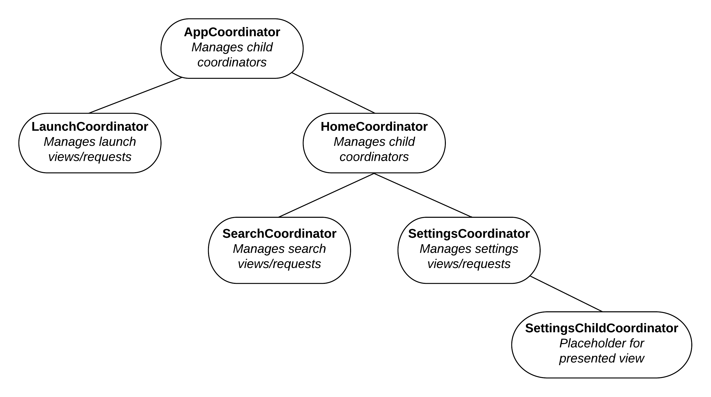

# jpeckner/CoordiNode

iOS apps are increasingly using the [coordinator pattern](http://khanlou.com/2015/10/coordinators-redux/) to manage their view flows. An online search for "iOS coordinator pattern" shows dozens of blog posts written on the topic since 2015. Less clear, though, is how to manage an app's overall *coordinator* flow- that is, how to transition control from one coordinator to another predictably and safely, especially in apps that use [universal links](https://developer.apple.com/ios/universal-links/). 

CoordiNode provides the tools you need to manage this flow in a simple, clean, and consistent way. It also integrates seemlessly with state management systems like Redux (though using such a system is not required). Unlike frameworks such as [route-composer](https://github.com/saksdirect/route-composer) and [XCoordinator](https://github.com/quickbirdstudios/XCoordinator), CoordiNode is completely UI-agnostic, making it simple to implement and maintain.

# Installation

## Prerequisites

The CoordiNode target itself has no dependencies, but its test target, and its code generation utility, require [Carthage](https://github.com/Carthage/Carthage#quick-start). After installing Carthage, run the following in the Terminal:
```
$ cd path/to/CoordiNode/BuildScripts
$ ./run_carthage_bootstrap.sh
```

## Defining your coordinator hierarchy
Before adding CoordiNode to your app, you'll need to define your app's coordinator hierarchy in a small YAML file. It will then be used to auto-generate several files of boilerplate Swift code (just like [Sourcery](https://github.com/krzysztofzablocki/Sourcery) does), which you'll then add to your app target. You'll still need to write some additional code in your coordinators, but the generated code will help guide that process.

Read the [Principles](README.md#Principles) section below to learn how this hierarchy works. You can also see [PlacesFinder](https://github.com/jpeckner/PlacesFinder) for an example app that uses CoordiNode, including [the YAML file it uses](https://github.com/jpeckner/PlacesFinder/blob/master/PlacesFinder/PlacesFinder/CoordiNode/ModuleStructure.yml).

## Running the generator script

1. Add CoordiNode to your app as a submodule or Carthage dependency.
1. Make sure that your coordinator classes have been defined in your app target, even if they're currently empty.
1. Create an empty directory in your app project folder; this will be where CoordiNode outputs the generated boilerplate code.
1. In the Terminal, run:
    ```
    $ cd path/to/CoordiNode/BuildScripts
    $ chmod +x coordinode_generator.sh
    $ ./coordinode_generator.sh <path_to_YAML_file> <path_to_output_directory>
    ```
1. After the script completes, add the generated files to your app target.
1. Build your app. You'll very likely be seeing compile errors! 🙂 That's because the generated code will add protocol extensions to all of your coordinators, and in some of them, you'll need to implement methods for instantiating and/or switching between child coordinators, depending on the coordinator flow state. Be sure to click the "Fix" button that Xcode displays next to each error to make this process as smooth as possible.
1. Finally, you'll need to trigger transitions between your coordinators at appropriate times for your app. To help with this, CoordiNode includes two classes, `RoutingHandler` and `DestinationRoutingHandler`, which encapsulate all of the generalized logic needed for coordinator transitions. See the Principles section below for more on how this works, as well as [AppCoordinator](https://github.com/jpeckner/PlacesFinder/blob/master/PlacesFinder/PlacesFinder/Modules/App/AppCoordinator.swift) and [HomeCoordinator](https://github.com/jpeckner/PlacesFinder/blob/master/PlacesFinder/PlacesFinder/Modules/Home/HomeCoordinator.swift) in PlacesFinder for working examples.

# Principles

CoordiNode is based on the following principles, which will likely feel familiar to those who've used the coordinator pattern before:

1. *Coordinators are organized in a tree-hierarchy; each coordinator has 0 - n child coordinators.*

   For example, this is the hierarchy for [PlacesFinder](https://github.com/jpeckner/PlacesFinder):

1. *The app's coordinator tree is never empty.*

   Many apps call the root node class `AppCoordinator`, but CoordiNode allows you to use any name you wish.
1. *The app always has exactly one "active" coordinator*.

   Typically, this is whichever coordinator is currently displaying views to the user. However, CoordiNode is UI-agnostic, so how you define "active" is up to you.
1. *Only the [lowest-common ancestor](https://en.wikipedia.org/wiki/Lowest_common_ancestor) (LCA) of currently-active coordinator `current` and desired-active coordinator `destination`, can perform the transition from `current` to `destination`.*
    
   Examples from the hierarchy diagram above:
   * If `LaunchCoordinator` is currently the active coordinator, but we now want to make `SearchCoordinator` active, only their LCA `AppCoordinator` can make this change.
   * If `SearchCoordinator` is currently the active coordinator, but we now want to make `SettingsCoordinator` active, only their LCA `HomeCoordinator` can make this change.

   This principle eliminates the need to scatter the logic for coordinator transitions throughout the codebase. Instead, the transition between any given pair of coordinators happens in one single place- their LCA. How you perform this transition (a root view-controller swap, presenting a modal view, etc.) is up to you, since CoordiNode is agnostic to the exact content of your app.
1. *Only certain coordinators, which you specify, can be designated as the `destination` coordinator.*

   Consider `LaunchCoordinator` again- when it's finished launching the app, another coordinator has to be designated as the next one to become and remain active. But not every coordinator is necessarily eligible for this. Only certain coordinators, like `SearchCoordinator` and `SettingsCoordinator`, are potential "destinations"- i.e., they manage UI content, handle user input, or have some other tangible impact on UX for an extended period of time. Others, such as `AppCoordinator` and `HomeCoordinator`, are instantiated only to reach destination coordinators further down the tree; they themselves should never be designated as the destination coordinator. 
   
   As such, CoordiNode's protocols and methods are structured to enforce, at compile-time, that only coordinators implementing `protocol DestinationCoordinatorProtocol` can be designated as the next destination coordinator. By default, the script implements `DestinationCoordinatorProtocol` on each coordinator if and only if it's a leaf, but you can customize this via each coordinator's `isDestinationNode` boolean in your YAML file.

# Further Reading

* [Coordinators Redux](http://khanlou.com/2015/10/coordinators-redux/): one of the seminal posts about using the coordinator pattern in iOS
* [Navigation in Swift](https://www.swiftbysundell.com/posts/navigation-in-swift): another great overview on the coordinator pattern
* [PlacesFinder](https://github.com/jpeckner/PlacesFinder) demonstrates how to setup and use CoordiNode effectively, including using it to support deep linking

# Built With

* [Nimble](https://github.com/Quick/Nimble) - Swift matcher framework
* [Quick](https://github.com/Quick/Quick) - Swift BDD testing framework
* [Yams](https://github.com/jpsim/Yams) - YAML parsing

# License

This project is licensed under the MIT License - see the [LICENSE](LICENSE) file for details.
